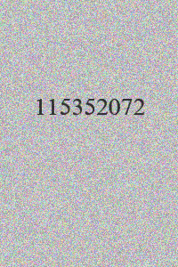
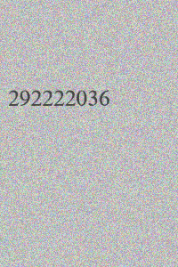
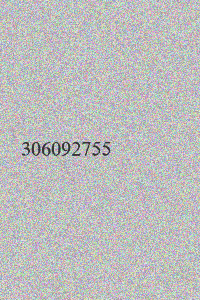

# Convolutional Recurrent Neural Network for Number Extraction - TensorFlow 2


[](https://arxiv.org/abs/1507.05717)
[](https://zhuanlan.zhihu.com/p/122512498)

## Changes made in this fork

This repository provides an edited implementation of the CRNN network in TensorFlow 2. This implementation focused only on number extraction from image - a simpler task. The main changes include creating a dataset builder class that creates a very specific dataset with numbers on a paper-like background with some noise and augmentation applied to it. It also provides with configuration files and script for saving such dataset as images in a directory structure.

Some necessary changes to the were done to make it runnable with TensorFlow 2.10. The code was also refactored to be more readable and files located meaningfully.

Original readme with information regarding the original implementation follows.

## Original repository description

This is a re-implementation of the CRNN network, build by TensorFlow 2. This repository may help you to understand how to build an End-to-End text recognition network easily. Here is the official [repo](https://github.com/bgshih/crnn) implemented by [bgshih](https://github.com/bgshih).

### Abstract

This repo aims to build a simple, efficient text recognize network by using the various components of TensorFlow 2. The model build by the Keras API, the data pipeline build by `tf.data`, and training with `model.fit`, so we can use most of the functions provided by TensorFlow 2, such as `Tensorboard`, `Distribution strategy`, `TensorFlow Profiler` etc.

### Installation

```bash
$ pip install -r requirements.txt
```

### Demo

Here I provide an example model that trained on the Numbers dataset, this model can only predict 9-digit numbers.

```bash
$ wget https://github.com/danielkonecny/number-extraction/releases/download/v0.3.0/Model.zip
$ unzip Model.zip -d Model
$ python tools/demo.py --images example/images/ --config configs/numbers3.yml --model Model
```

Then, You will see output like this:
```
Path: example/images/word_1.png, y_pred: [b'tiredness'], probability: [0.9998626]
Path: example/images/word_3.png, y_pred: [b'a'], probability: [0.67493004]
Path: example/images/2_Reimbursing_64165.jpg, y_pred: [b'reimbursing'], probability: [0.990946]
Path: example/images/word_2.png, y_pred: [b'kills'], probability: [0.9994573]
Path: example/images/1_Paintbrushes_55044.jpg, y_pred: [b'paintbrushes'], probability: [0.9984008]
Path: example/images/3_Creationisms_17934.jpg, y_pred: [b'creationisms'], probability: [0.99792457]
```

About decode methods, sometimes the beam search method will be better than the greedy method, but it's costly.

### Train

Before you start training, maybe you should [prepare](#Data-prepare) data first. All predictable characters are defined by the [table.txt](example/table.txt) file. The configuration of the training process is defined by the [yml](configs/numbers3.yml) file.

This training script uses all GPUs by default, if you want to use a specific GPU, please set the `CUDA_VISIBLE_DEVICES` parameter.

```bash
$ python tools/train.py --config configs/numbers3.yml --save_dir PATH/TO/SAVE
```

The training process can visualize in Tensorboard. 

```bash
$ tensorboard --logdir PATH/TO/MODEL_DIR
```

For more instructions, please refer to the [config](configs/numbers3.yml) file.

### Data prepare

To train this network, you should prepare a lookup table, images and corresponding labels. Example data is copy from [MJSynth](https://www.robots.ox.ac.uk/~vgg/data/text/) and [ICDAR2013](https://rrc.cvc.uab.es/?ch=2&com=introduction) dataset.

#### [Lookup table](./example/table.txt)

The file contains all characters and blank labels (in the last or any place both ok, but I find Tensorflow decoders can't change it now, so set it to last). By the way, you can write any word as blank.

#### Image data

It's an End-to-End method, so we don't need to indicate the position of the character in the image.





The labels corresponding to these three pictures are `Paintbrushes`, `Creationisms`, `Reimbursing`.

#### Annotation file

We should write the image path and its corresponding label to a text file in a certain format such as example data. The data input pipeline will automatically detect the support format. Customization is also very simple, please check out the [dataset factory](crnn/dataset_factory.py).

##### Support format

- [MJSynth](./example/mjsynth_annotation.txt)
- [ICDAR2013/2015](./example/icdar2013_annotation.txt)
- [Simple](./example/simple_annotation.txt) such as [example.jpg label]

### Eval

```bash
$ python tools/eval.py --config PATH/TO/CONFIG_FILE --weight PATH/TO/MODEL_WEIGHT
```

### Converte & Ecosystem

There are many components here to help us do other things. For example, deploy by `Tensorflow serving`. Before you deploy, you can pick up a good weight, and convertes model to `SavedModel` format by this command, it will add the post-processing layer in the last and cull the optimizer:

```bash
$ python tools/export.py --config PATH/TO/CONFIG_FILE --weight PATH/TO/MODEL_WEIGHT --pre rescale --post greedy --output PATH/TO/OUTPUT
```

And now `Tensorflow lite` also can convert this model, that means you can deploy it to Android, iOS etc.

Note. Decoders can't convert to `Tensorflow lite` because of the assets. Use the softmax layer or None.